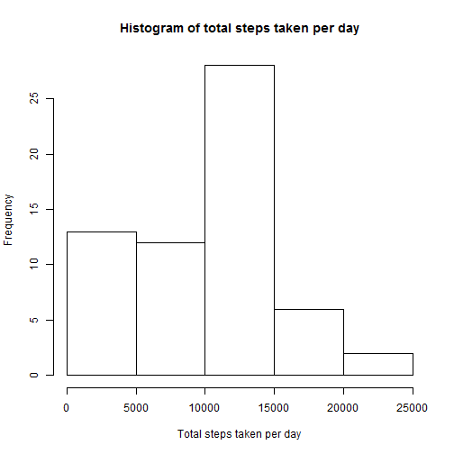
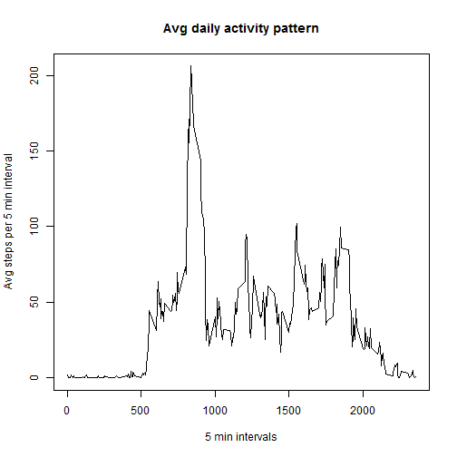
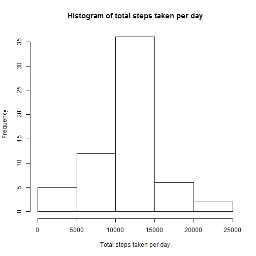
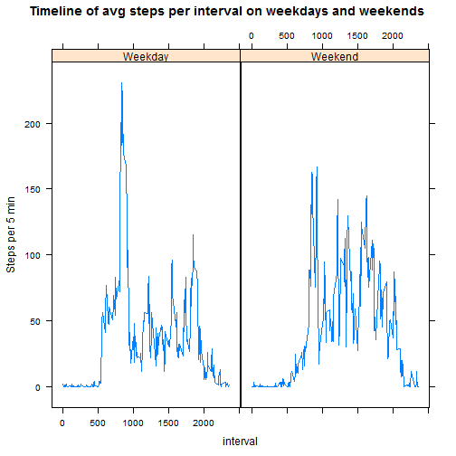

Reproducible Research : Course Project 1
============================================================================

It is now possible to collect a large amount of data about personal movement using activity monitoring devices such as a Fitbit, Nike Fuelband, or Jawbone Up. These type of devices are part of the "quantified self" movement - a group of enthusiasts who take measurements about themselves regularly to improve their health, to find patterns in their behavior, or because they are tech geeks. But these data remain under-utilized both because the raw data are hard to obtain and there is a lack of statistical methods and software for processing and interpreting the data.

This assignment makes use of data from a personal activity monitoring device. This device collects data at 5 minute intervals through out the day. The data consists of two months of data from an anonymous individual collected during the months of October and November, 2012 and include the number of steps taken in 5 minute intervals each day.

##Loading and processing the data


```r
database<-read.csv("C:/Users/Subrata/Coursera/Coursera 5/RepData_PeerAssessment1/activity.csv", na.strings=NA)
str(database)
```

##Analysis on total number of steps taken per day


```r
library(dplyr)
stepdates<-group_by(database,date)
TotalStepsPerDay<-summarize(stepdates, stepsperday =sum(steps,na.rm = TRUE))
hist(TotalStepsPerDay$stepsperday, main = "Histogram of total steps taken per day", xlab = "Total steps taken per day")
```



```r
mean<-round(mean(TotalStepsPerDay$stepsperday,na.rm=TRUE))
median<-median(TotalStepsPerDay$stepsperday,na.rm=TRUE)
```

It is estimated that the mean of the total number of steps taken per day is ~9354 steps and the median for the same is 10395 steps.

##Analysis on average daily activity pattern


```r
intervaldates<-group_by(database,interval)
AvgStepsPer5min<-summarize(intervaldates, stepsper5min =mean(steps,na.rm = TRUE))
with(AvgStepsPer5min,{
  plot(interval,stepsper5min,
       main="Avg daily activity pattern", 
       xlab="5 min intervals",
       ylab="Avg steps per 5 min interval",
       type ='l')
})
```



```r
max<-round(max(AvgStepsPer5min$stepsper5min))
maxinterval<-round(AvgStepsPer5min[round(AvgStepsPer5min$stepsper5min)==max,1]/100, digits = 2)
```

The daily activiy patterns shows maximum number of steps are taken during the 8.35 AM 5 min slot at 206 steps on average.

##Addressing missing values in the dataset


```r
CountNA<-max(sum(is.na(database$steps)),sum(is.na(database$interval)),sum(is.na(database$date)))
```

There are totally 2304 number of rows with missing values in the dataset. All the missing values are for the steps variable in the dataset.

##Missing value Imputing strategy 

For every interval in a day, where there are missing values for steps, we will impute that missing step value with the avg steps taken in that interval on average in the dataset.


```r
databaseimputed<-database
for(i in 1:nrow(databaseimputed)){
if(is.na(databaseimputed$steps[i])){
databaseimputed$steps[i]<-as.numeric(AvgStepsPer5min[AvgStepsPer5min$interval==databaseimputed$interval[i],2])}
}
```
New database created: databaseimputed

##Recalculating total steps, mean and median of steps on imputed database


```r
stepdates<-group_by(databaseimputed,date)
TotalStepsPerDayimputed<-summarize(stepdates, stepsperday =sum(steps))
hist(TotalStepsPerDayimputed$stepsperday, main = "Histogram of total steps taken per day", xlab = "Total steps taken per day")
```



```r
recomputemean<-round(mean(TotalStepsPerDayimputed$stepsperday),digits = 2)
recomputemedian<-median(TotalStepsPerDayimputed$stepsperday)
```

It is estimated that:
The mean of the total number of steps taken per day is ~1.076619 &times; 10<sup>4</sup>steps 
The median for the same is 1.0766189 &times; 10<sup>4</sup> steps.


Compared to previous computations of mean and median, the revised strategy shows an increase in mean by 15.1% and increase in median by 3.57% 

##Analyzing activity patterns in weekdays and weekends


```r
## Creating new factor variable

databaseimputed<-mutate(databaseimputed, weekidentified=factor((weekdays(as.Date(date))=="Saturday" |weekdays(as.Date(date))=="Sunday" ),labels=c("Weekday","Weekend")))

## Segmenting data into weekend and weekday factors


intervaldates<-group_by(databaseimputed,interval,weekidentified)
AvgStepsPer5min<-summarize(intervaldates, stepsper5min =mean(steps,na.rm = TRUE))

library(lattice)
xyplot(stepsper5min ~ interval | weekidentified, data= AvgStepsPer5min, layout=c(2,1), type ='l', main ="Timeline of avg steps per interval on weekdays and weekends",ylab="Steps per 5 min")
```



The average number of steps in weekends is 1.220152 &times; 10<sup>4</sup> steps compared to 1.025585 &times; 10<sup>4</sup> steps in weekdays.

This shows that people walk more on weekends that on weekdays.


